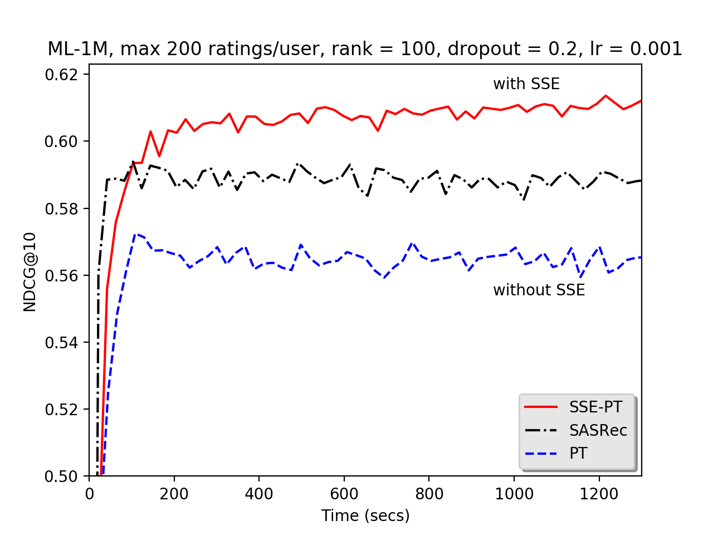

# Codes for SSE-PT and PT in the paper submission

- Codes should work under both python2/python3, we include movielens1m data as reference.

- We tested using tensorflow 1.11.0 with Python 2.7.13 & 3.5.3 with Nvdia P100 and V100 GPU.

- We did not change README file in the baseline folder as it's for codes of the original paper that got released on github.

1. To run SSE-PT, do
```
python main.py --dataset=ml-1m --batch_size=128 --train_dir="default" 
--user_hidden_units 50 --item_hidden_units 50 --num_blocks=2 --maxlen=200 
--dropout_rate 0.2 --num_head=1 --lr=0.001 --num_epochs 2001 --gpu 0 
--threshold_user=0.08 --threshold_item 0.9 --print_freq 100
```

2. To run PT without SSE, simply set `threshold_user=1.0 --threshold_item=1.0`, i.e. do below:
```
python main.py --dataset=ml-1m --batch_size=128 --train_dir="default" 
--user_hidden_units 50 --item_hidden_units 50 --num_blocks=2 --maxlen=200 
--dropout_rate 0.2 --num_head=1 --lr=0.001 --num_epochs 2001 --gpu 0 
--threshold_user=1.0 --threshold_item 1.0 --print_freq 100
```

3. To baseline SASRec, go to baseline folder and type below:
```
python main.py --dataset=ml-1m --batch_size=128 --train_dir="default" 
--hidden_units 100 --num_blocks=2 --maxlen=200 --dropout_rate 0.2 --num_head=1 
--lr=0.001 --num_epochs 2001 --gpu 0 --l2_emb 0.0001
```


