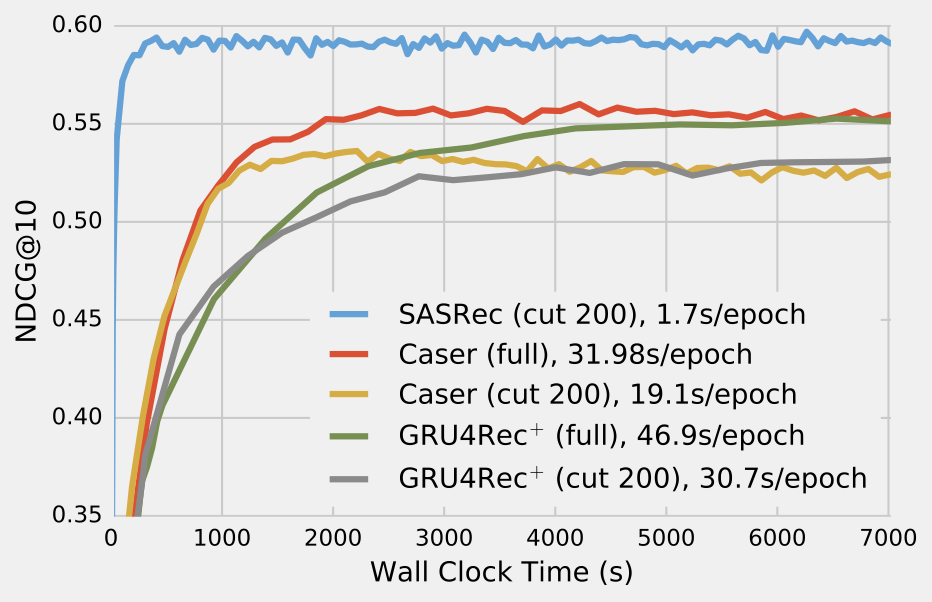

# SASRec: Self-Attentive Sequential Recommendation

This is our TensorFlow implementation for the paper:

Wang-Cheng Kang, Julian McAuley. *[Self-Attentive Sequential Recommendation.](https://cseweb.ucsd.edu/~jmcauley/pdfs/icdm18.pdf)* In Proceedings of IEEE International Conference on Data Mining (ICDM'18)

Please cite our paper if you use the code or datasets.

The code is tested under a Linux desktop (w/ GTX 1080 Ti GPU) with TensorFlow 1.2.

## Datasets

The preprocessed datasets are included in the repo (`e.g. data/Video.txt`), where each line contains an `user id` and 
`item id` (starting from 1) meaning an interaction (sorted by timestamp).

The data pre-processing script is also included. For example, you could download Amazon review data from *[here.](http://jmcauley.ucsd.edu/data/amazon/index.html)*, and run the script to produce the `txt` format data.  

## Model Training

To train our model on `Video` (with default hyper-parameters): 

```
python main.py --dataset=Video --train_dir=default 
```

or on `ml-1m`:

```
python main.py --dataset=ml-1m --train_dir=default --maxlen=200 --dropout_rate=0.2 
``` 

## Misc

The implemention of self attention is modified based on *[this](https://github.com/Kyubyong/transformer)*

The convergence curve on `ml-1m`, compared with CNN/RNN based approaches:  

